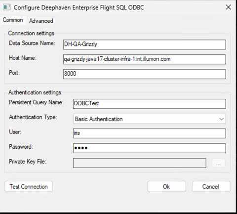

# Deephaven Enterprise Flight SQL ODBC Driver - User Guide

**For End Users and Application Integrators**

This guide helps you install, configure, and use the Deephaven Enterprise Flight SQL ODBC driver to connect applications like PowerBI, Excel, and Tableau to Deephaven Enterprise servers.

## Quick Start

**New to the driver?** Follow these steps to get up and running in minutes:

1. **Install the driver** (5 minutes)
   - Double-click `Deephaven-Enterprise-Flight-SQL-ODBC-<version>-win64.msi`
   - Follow the installation wizard
   - See [Installation](#installation) for details

2. **Configure a DSN** (5 minutes)
   - Open ODBC Data Source Administrator (`Win + R`, type `odbcad32.exe`)
   - Click **Add...**, select **Deephaven Enterprise Flight SQL ODBC Driver**
   - Fill in: Host, Port, Persistent Query Name, Username/Password
   - Click **Test Connection** to verify
   - See [Configuring a DSN](#configuring-a-dsn) for details

3. **Test your connection** (2 minutes)
   - Run the provided PowerShell test script
   - See [Testing Your Connection](#testing-your-connection)

4. **Connect from PowerBI** (5 minutes)
   - Open PowerBI → Get Data → ODBC
   - Select your DSN and load tables
   - See [Using with PowerBI](#using-with-powerbi) for details

**Total time: ~20 minutes** ⏱️

---

## Table of Contents

- [Installation](#installation)
  - [Windows (MSI Installer)](#windows-msi-installer)
- [Configuring a DSN](#configuring-a-dsn)
  - [Windows Configuration](#windows-configuration)
  - [Connection String Format](#connection-string-format)
- [Testing Your Connection](#testing-your-connection)
  - [PowerShell Test Script](#powershell-test-scripts)
- [Application Integration](#application-integration)
  - [PowerBI Desktop](#powerbi-desktop)
  - [PowerBI Service](#powerbi-service-enterprise-gateway)
  - [Microsoft Excel](#microsoft-excel)
  - [Other Applications](#other-applications)
- [Troubleshooting](#troubleshooting)
- [FAQ](#frequently-asked-questions-faq)
- [Future Plans](#future-plans)
- [Support](#support)

---

## Installation

### Windows (MSI Installer)

The easiest way to install the Deephaven Enterprise Flight SQL ODBC driver on Windows.

#### Prerequisites

- Windows 10 or Windows 11 (64-bit)
- Administrator privileges for installation

#### Installation Steps

> ⚠️ **Security Warning:** The installer is currently unsigned. Windows will display a security warning when you run it. This is normal and expected. Future versions will be digitally signed.

1. **Download the Installer**
   - Obtain `Deephaven-Enterprise-Flight-SQL-ODBC-<version>-win64.msi` from your Deephaven administrator or download location
   - Verify the file came from a trusted source

2. **Run the Installer**
   - Double-click the MSI file
   - **Windows Security Warning:** You may see one or both of these warnings:
     
     **Windows Defender SmartScreen Warning:**
     - Message: "Windows protected your PC" or "Unknown publisher"
     - Click **More info**
     - Click **Run anyway**
     
     **User Account Control (UAC) Prompt:**
     - Message: "Do you want to allow this app to make changes to your device?"
     - Publisher will show as "Unknown"
     - Click **Yes** to allow the installation
   
   - Follow the installation wizard:
     - Click **Next** on the welcome screen
     - Review and accept the license agreement
     - Choose the installation directory (default: `C:\Program Files\Deephaven Enterprise Flight SQL ODBC\`)
     - Click **Install**
     - Click **Finish** when complete

3. **Verify Installation**
   - Open **ODBC Data Source Administrator**:
     - **Method 1:** Press `Win + R`, type `odbcad32.exe`, press Enter
     - **Method 2:** Control Panel → Administrative Tools → ODBC Data Sources (64-bit)
     - **Method 3:** Search for "ODBC Data Sources (64-bit)" in Start menu
   - Go to the **Drivers** tab
   - Look for **Deephaven Enterprise Flight SQL ODBC Driver** in the list
   - It should show version information and file path

> **Important:** Always use the 64-bit ODBC Administrator (`C:\Windows\System32\odbcad32.exe`). Do not use the 32-bit version (`C:\Windows\SysWOW64\odbcad32.exe`).

> **Note:** Currently, only Windows is supported with the MSI installer. Linux and macOS support is planned for future releases. See [Future Plans](#future-plans) for more information.

---

## Configuring a DSN

A Data Source Name (DSN) stores your connection settings so you don't have to enter them every time.

### Windows Configuration

#### Creating a User DSN

1. **Open ODBC Data Source Administrator**
   - **Method 1:** Press `Win + R`, type `odbcad32.exe`, press Enter
   - **Method 2:** Control Panel → Administrative Tools → ODBC Data Sources (64-bit)
   - **Method 3:** Search for "ODBC Data Sources (64-bit)" in Start menu

2. **Create New DSN**
   - Go to the **User DSN** tab (or **System DSN** if you want all users to access it)
   - Click **Add...**
   - Select **Deephaven Enterprise Flight SQL ODBC Driver** from the list
   - Click **Finish**

3. **Configure Connection (General Tab)**

   
   
   **Data Source Name:**
   - Enter a descriptive name (e.g., `Deephaven Production`, `DH Dev Server`)
   - This is the name you'll select in applications like PowerBI

   **Description:** (Optional)
   - Add a description (e.g., `Deephaven Enterprise Production Cluster`)

   **Host Name:** (Required)
   - Enter the Deephaven server hostname or IP address
   - Example: `deephaven.mycompany.com` or `192.168.1.100`

   **Port:** (Required)
   - Default: `10000`
   - Contact your Deephaven administrator if using a different port

   **Persistent Query Name:** (Required)
   - Enter the name of the Persistent Query (PQ) you want to connect to
   - Example: `my_analytics_pq` or `prod_data_pq`
   - This field is mandatory for Deephaven Enterprise connections

   **Authentication Type:**
   - Select your authentication method:
     - **Basic Authentication:** Use username and password
     - **Private Key Authentication:** Use username and private key file

   **If using Basic Authentication:**
   - **User:** Enter your username
   - **Password:** Enter your password
   - Both fields will be enabled

   **If using Private Key Authentication:**
   - **User:** This field will be disabled
   - **Password:** This field will be disabled
   - **Private Key File Path:** Enter the full path to your private key file
     - Example: `C:\Users\yourusername\deephaven_key.txt`
     - Or click **Browse** to select the file
     - The key file is a special Deephaven format that contains the username, public key, and private key

   > **Note:** Basic Authentication and Private Key Authentication are mutually exclusive. When you select Private Key Authentication, the username and password fields are automatically disabled. The username is read from the private key file itself, which uses a custom Deephaven format.

4. **Test Connection**
   - Click **Test Connection** button at the bottom
   - If successful, you'll see: "Connection successful"
   - If it fails, check:
     - Host name and port are correct
     - Credentials are valid
     - Persistent Query Name exists and you have access
     - Network connectivity (firewall, VPN)
     - TLS settings match server configuration

5. **Save DSN**
   - Click **OK** to save the DSN
   - Your DSN is now ready to use in applications

### Connection String Format

If you need to connect without a DSN (programmatically), use this format:

**With Basic Authentication:**
```
Driver={Deephaven Enterprise Flight SQL ODBC Driver};HOST=deephaven.mycompany.com;PORT=10000;UID=myusername;PWD=mypassword;PQName=my_pq;useEncryption=true;
```

**With Private Key Authentication:**
```
Driver={Deephaven Enterprise Flight SQL ODBC Driver};HOST=deephaven.mycompany.com;PORT=10000;PrivateKeyFilePath=C:\path\to\deephaven_key.txt;PQName=my_pq;useEncryption=true;
```

**Parameters:**
- `HOST` - Server hostname or IP (required)
- `PORT` - Server port, default 10000 (required)
- `UID` - Username (required for basic auth only)
- `PWD` - Password (required for basic auth only)
- `PrivateKeyFilePath` - Path to private key file in Deephaven format (required for private key auth, mutually exclusive with UID/PWD)
- `PQName` - Persistent Query Name (required)
- `useEncryption` - `true` or `false`, default is `false`
- `disableCertificateVerification` - `true` or `false`, default is `false`

#### Private Key File Format

The private key file uses a custom Deephaven format (plain text, typically with `.txt` extension):

```
# Deephaven Private Key File
# Lines beginning with # are comments

user myusername
operateas myusername
public MIIBIjANBgkqhkiG9w0BAQEFAAOCAQ8AMIIBCgKCAQEA...
private MIIEvgIBADANBgkqhkiG9w0BAQEFAASCBKgwggSkAgEAAoIBAQC...
```

**Fields:**
- `user` - Your username for authentication
- `operateas` - The user identity to operate as (typically same as `user`)
- `public` - Public key in base64-encoded DER format (prefix with `EC:` for Elliptic Curve keys)
- `private` - Private key in base64-encoded DER format (prefix with `EC:` for Elliptic Curve keys)

> **Important:** This file contains sensitive credentials. Protect it like you would protect your password. Set appropriate file permissions to prevent unauthorized access.

---

## Testing Your Connection

### PowerShell Test Scripts

#### Simple Test Script

Save this as `test-deephaven-odbc.ps1`:

```powershell
<#
.SYNOPSIS
    Test Deephaven Enterprise ODBC connection
.PARAMETER DSN
    The Data Source Name to test
.EXAMPLE
    .\test-deephaven-odbc.ps1 -DSN "Deephaven Production"
#>
param(
    [Parameter(Mandatory=$true)]
    [string]$DSN
)

function Execute-Query {
    param(
        [Parameter(Mandatory=$true)]
        [System.Data.Odbc.OdbcConnection]$Connection,
        [Parameter(Mandatory=$true)]
        [string]$Query
    )
    
    Write-Host "`n========================================" -ForegroundColor Cyan
    Write-Host "Executing: $Query" -ForegroundColor Cyan
    Write-Host "========================================" -ForegroundColor Cyan
    
    try {
        $cmd = $Connection.CreateCommand()
        $cmd.CommandText = $Query
        $reader = $cmd.ExecuteReader()
        
        # Get column metadata
        $columnCount = $reader.FieldCount
        $columns = @()
        for ($i = 0; $i -lt $columnCount; $i++) {
            $columns += $reader.GetName($i)
        }
        
        Write-Host "`nColumns: $($columns -join ', ')" -ForegroundColor Green
        Write-Host ("=" * 80) -ForegroundColor Gray
        
        # Print rows
        $rowCount = 0
        while ($reader.Read()) {
            $rowData = @()
            for ($i = 0; $i -lt $columnCount; $i++) {
                if ($reader.IsDBNull($i)) {
                    $rowData += "NULL"
                } else {
                    $rowData += $reader.GetValue($i).ToString()
                }
            }
            Write-Host ($rowData -join ' | ')
            $rowCount++
        }
        
        Write-Host "`nRows returned: $rowCount" -ForegroundColor Green
        
        $reader.Close()
        $cmd.Dispose()
    }
    catch {
        Write-Host "ERROR: $_" -ForegroundColor Red
        Write-Host $_.Exception.Message -ForegroundColor Red
    }
}

# Test connection
Write-Host "Testing connection to DSN: $DSN" -ForegroundColor Yellow

try {
    # Create connection
    $conn = New-Object System.Data.Odbc.OdbcConnection
    $conn.ConnectionString = "DSN=$DSN"
    
    Write-Host "Opening connection..." -ForegroundColor Yellow
    $conn.Open()
    Write-Host "Connection successful!" -ForegroundColor Green
    
    # Run test queries
    Execute-Query -Connection $conn -Query "SELECT 1 AS test_column"
    Execute-Query -Connection $conn -Query "SELECT 42 AS answer, 'Hello Deephaven' AS message"
    
    # Query tables from your Persistent Query
    # Uncomment and modify the following line to query actual tables:
    # Execute-Query -Connection $conn -Query "SELECT * FROM your_table_name"
    
    # Close connection
    $conn.Close()
    Write-Host "`nConnection closed successfully." -ForegroundColor Green
}
catch {
    Write-Host "`nERROR: Connection failed!" -ForegroundColor Red
    Write-Host $_.Exception.Message -ForegroundColor Red
    exit 1
}
```

**Run the script:**

> ⚠️ **PowerShell Execution Policy:** By default, Windows prevents running PowerShell scripts. You have two options:

**Option 1: Bypass Policy for Single Execution (No Admin Required)**
```powershell
powershell -ExecutionPolicy Bypass -File .\test-deephaven-odbc.ps1 -DSN "Deephaven Production"
```

This bypasses the execution policy just for this one script run. No permanent changes, no admin rights needed.

**Option 2: Enable Script Execution Permanently (Requires Admin Once)**
```powershell
# Open PowerShell as Administrator and run:
Set-ExecutionPolicy RemoteSigned -Scope CurrentUser
```

This is a one-time setup. After this, you can run scripts normally:
```powershell
.\test-deephaven-odbc.ps1 -DSN "Deephaven Production"
```

**Expected output:**
```
Testing connection to DSN: Deephaven Production
Opening connection...
Connection successful!

========================================
Executing: SELECT 1 AS test_column
========================================

Columns: test_column
================================================================================
1

Rows returned: 1

Connection closed successfully.
```

**Querying Your Persistent Query Tables:**

Once the basic connection test succeeds, you can query actual tables from your Persistent Query. Edit the script and uncomment the line:

```powershell
# Execute-Query -Connection $conn -Query "SELECT * FROM your_table_name"
```

Replace `your_table_name` with the name of a table in your Persistent Query. For example:

```powershell
Execute-Query -Connection $conn -Query "SELECT * FROM customers"
Execute-Query -Connection $conn -Query "SELECT * FROM orders WHERE order_date > '2026-01-01'"
```

This will display the table's columns, data, and row count.

---

## Application Integration

### PowerBI Desktop

Connect PowerBI Desktop to Deephaven Enterprise:

1. **Open PowerBI Desktop**

2. **Get Data**
   - Click **Home** → **Get Data** → **More...**
   - Or click **Get Data** in the ribbon

3. **Select ODBC**
   - In the search box, type `ODBC`
   - Select **ODBC** from the list
   - Click **Connect**

4. **Choose DSN**
   - **Option 1: Use DSN**
     - Select your DSN from the **Data source name (DSN)** dropdown
     - Example: Select `Deephaven Production`
     - Click **OK**
   
   - **Option 2: Use Connection String**
     - Select **Advanced options**
     - Enter the full connection string
     - Click **OK**

5. **Enter Credentials** (if prompted)
   - Select **Database** authentication
   - Enter username and password
   - Click **Connect**

6. **Navigator Window**
   - You'll see a list of available tables from your Persistent Query
   - Select the tables you want to import
   - Preview the data on the right side
   - Choose import mode:
     - **Load**: Import data directly
     - **Transform Data**: Open Power Query Editor for data transformation

7. **Load Data**
   - Click **Load** to import the data
   - Your data is now available in PowerBI for visualization

#### Tips for PowerBI

- **Performance**: 
  - Use **Import** mode for better performance with smaller datasets
  - Use **DirectQuery** mode for real-time data, but expect slower performance
  - Create aggregations in Deephaven before importing to PowerBI

- **Data Types**: 
  - PowerBI automatically maps ODBC data types
  - Review data types in Power Query Editor if needed

- **Relationships**: 
  - Define relationships between tables in PowerBI's model view
  - Use Deephaven's native joins when possible before importing

- **Refresh**: 
  - In PowerBI Desktop, click **Refresh** to reload data
  - Schedule automatic refresh in PowerBI Service

### PowerBI Service (Enterprise Gateway)

For PowerBI Service, you need an On-Premises Data Gateway:

1. **Install On-Premises Data Gateway**
   - Download from: https://powerbi.microsoft.com/en-us/gateway/
   - Install on a Windows server that can access Deephaven

2. **Configure Gateway**
   - Open **On-Premises Data Gateway** application
   - Sign in with your PowerBI account
   - Register the gateway

3. **Add Data Source**
   - In PowerBI Service, go to **Settings** → **Manage gateways**
   - Select your gateway
   - Click **Add data source**
   - **Data Source Name**: `Deephaven Enterprise`
   - **Data Source Type**: **ODBC**
   - **Connection String**: Enter your connection string (without password):
     ```
     Driver={Deephaven Enterprise Flight SQL ODBC Driver};HOST=deephaven.mycompany.com;PORT=10000;PQName=my_pq;useEncryption=true;
     ```
   - **Authentication Method**: Basic
   - **Username**: Your username
   - **Password**: Your password
   - Click **Add**

4. **Schedule Refresh**
   - Publish your PowerBI report to the service
   - Go to dataset settings
   - Configure scheduled refresh using the gateway

### Microsoft Excel

Connect Excel to Deephaven Enterprise:

1. **Open Excel**

2. **Get Data from ODBC**
   - Go to **Data** tab → **Get Data** → **From Other Sources** → **From ODBC**

3. **Select DSN**
   - Choose your Deephaven DSN from the dropdown
   - Click **OK**

4. **Enter Credentials**
   - Enter username and password if prompted
   - Click **Connect**

5. **Navigator**
   - Select tables to import
   - Click **Load** or **Transform Data**

6. **Refresh Data**
   - Right-click on the table → **Refresh**
   - Or use **Data** tab → **Refresh All**

### Other Applications

The driver works with any ODBC-compliant application:

- **Tableau**: Connect via "Other Databases (ODBC)"
- **Python**: Use `pyodbc` library
- **R**: Use `RODBC` package
- **SQL clients**: DBeaver, DataGrip, etc.

---

## Troubleshooting

### Installation Issues

**Problem: "Cannot find the driver" after installation**

**Solutions:**
- Verify you're using 64-bit ODBC Administrator (`C:\Windows\System32\odbcad32.exe`)
- Check registry:
  ```powershell
  Get-ItemProperty "HKLM:\SOFTWARE\ODBC\ODBCINST.INI\Deephaven Enterprise Flight SQL ODBC Driver"
  ```
- Reinstall the MSI as Administrator

### Connection Issues

**Problem: "Persistent Query not found"**

**Solutions:**
- Verify the PQ name is spelled correctly (case-sensitive)
- Check that the PQ is running on the server
- Verify you have permissions to access the PQ
- Contact your Deephaven administrator

**Problem: "Must be authenticated" or "Unauthenticated" error**

**Solutions:**
- Verify username and password are correct (for Basic Authentication)
- If using Private Key Authentication:
  - Check that the private key file path is correct and readable
  - Verify the file is in the correct Deephaven format with `user`, `operateas`, `public`, and `private` fields
  - Verify the public key is registered on the server for the username specified in the file
  - Ensure the file is not corrupted and all base64-encoded values are complete
- For servers behind Envoy proxy, ensure TLS is enabled (`useEncryption=true`)

**Problem: "http2 header with status: 405" error**

**Solutions:**
- Verify the host and port are correct
- Check if you need to use TLS (`useEncryption=true`)
- Verify you're connecting to the correct service endpoint (not the web UI port)

### PowerBI Issues

**Problem: PowerBI fails to connect but Test Connection works**

**Solutions:**
- Verify you're using 64-bit PowerBI Desktop
- Try using connection string instead of DSN
- Clear PowerBI's data source cache:
  - File → Options and settings → Options → Data Load → Clear cache
- Restart PowerBI Desktop

**Problem: "The driver didn't supply any tables"**

**Solutions:**
- Verify your Persistent Query has tables defined and published
- Check that the PQ is in a running state
- Try querying specific tables using SQL in Power Query Editor

### Excel Issues

**Problem: "Data source name not found"**

**Solutions:**
- Verify the DSN is created as a System DSN if Excel runs under a different account
- Ensure Excel is 64-bit
- Check that the DSN name doesn't contain special characters

### Private Key Authentication Issues

**Problem: "Cannot read private key file"**

**Solutions:**
- Verify the file path is absolute: `C:\Users\username\deephaven_key.txt`
- Ensure there are no typos in the path
- Check file permissions - file must be readable by your user account
- Verify the private key file format is correct (custom Deephaven dictionary format)
- Check that the file contains all required fields: `user`, `operateas`, `public`, `private`
- Ensure there are no line breaks in the middle of the base64-encoded key values
- Try opening the file in a text editor to verify it's not corrupted
- Try a simpler path like `C:\temp\deephaven_key.txt`

### Enabling Debug Logging

For troubleshooting, enable debug logging:

```powershell
# Windows PowerShell
$env:ARROW_ODBC_LOG_LEVEL="DEBUG"

# Then run your application from the same PowerShell window
```

**Valid log levels:** TRACE, DEBUG, INFO, WARNING, ERROR, FATAL

---

## Frequently Asked Questions (FAQ)

### General Questions

**Q: Why does Windows show a security warning when I install the driver?**

A: The installer is currently unsigned. Windows displays security warnings for unsigned software as a precaution. This is normal and expected behavior. To proceed:
- Click "More info" and then "Run anyway" for SmartScreen warnings
- Click "Yes" for UAC prompts
- Ensure you obtained the installer from your Deephaven administrator or a trusted source
- Future versions of the driver will be digitally signed to eliminate these warnings

**Q: Is it safe to install despite the security warning?**

A: Yes, if you obtained the installer from your Deephaven administrator or official source. The warning appears because the installer lacks a digital signature, not because it contains malware. Always verify the source before installing any software.

**Q: What is a Persistent Query (PQ)?**

A: A Persistent Query is a Deephaven Enterprise concept representing a running query process on the server that maintains state and serves tables. You must specify which PQ you want to connect to when creating an ODBC connection.

**Q: Can I connect to multiple Persistent Queries simultaneously?**

A: Yes, create separate DSNs for each Persistent Query. Each DSN can target a different PQ on the same or different servers.

**Q: Does the driver work with 32-bit applications?**

A: No, this is a 64-bit only driver. Your applications (PowerBI, Excel, etc.) must also be 64-bit.

### Authentication

**Q: Which authentication method should I use?**

A: 
- **Basic Authentication (Username/Password)**: Easiest for getting started, uses username and password
- **Private Key Authentication**: More secure, recommended for production and automated systems. Uses a Deephaven private key file that contains your username and cryptographic keys.

**Q: Can I store credentials in the DSN?**

A: Yes, but not recommended for security reasons, especially for Basic Authentication with passwords. For Private Key authentication, you specify the path to the key file in the DSN, but the file itself should be protected with proper file system permissions.

**Q: How do I get a private key file?**

A: Contact your Deephaven administrator. They will:
1. Generate a public/private key pair for you
2. Register the public key on the Deephaven server
3. Provide you with a private key file (typically `.txt` format)
4. The file contains your username, the public key, and the private key in a custom Deephaven format

**Q: What format is the private key file?**

A: The private key file uses a custom Deephaven format (not standard PEM or SSH format). It's a plain text file structured as a dictionary with these fields:
- `user` - Your username
- `operateas` - The user to operate as (typically same as `user`)
- `public` - Base64-encoded public key in DER format
- `private` - Base64-encoded private key in DER format

Lines beginning with `#` are comments. Each field is specified as `key value` on separate lines.

### TLS/Encryption

**Q: Should I enable TLS encryption?**

A: Yes, always enable TLS (`useEncryption=true`) for production. Only disable it for development on trusted networks.

**Q: What if I get certificate verification errors?**

A: 
- Production: Ensure your server has a valid certificate from a trusted CA
- Development: You can enable "Disable Certificate Verification" (not recommended for production)

### Performance

**Q: Why is my PowerBI report slow?**

A: 
- Use Import mode instead of DirectQuery when possible
- Create aggregations in Deephaven before importing
- Optimize queries to return only needed columns and rows
- Check network latency

**Q: Can I use DirectQuery mode in PowerBI?**

A: Yes, but it will be slower than Import mode because each visualization query hits the server in real-time.

### Updates

**Q: PowerShell won't run my test script. What do I do?**

A: Windows blocks PowerShell scripts by default. Error message: "cannot be loaded because running scripts is disabled on this system."

**Quick Solution (No Admin Required):**
```powershell
powershell -ExecutionPolicy Bypass -File .\test-deephaven-odbc.ps1 -DSN "YourDSN"
```

This bypasses the policy just for this one execution. No permanent changes.

**Permanent Solution (Admin Required, One-Time Setup):**
```powershell
# Open PowerShell as Administrator
Set-ExecutionPolicy RemoteSigned -Scope CurrentUser
```

Then run scripts normally. This allows local scripts while requiring downloaded scripts to be signed.

**Q: How do I update to a new version?**

A: Simply run the new MSI installer. It will upgrade the existing installation. Your DSN configurations are preserved.

**Q: Can I roll back to a previous version?**

A: Yes, uninstall the current version and install the previous MSI. Your DSN configurations will remain.

---

## Future Plans

### Linux Support

Linux support is planned for a future release. The driver will support standard Linux distributions with unixODBC.

**Planned Installation (Linux):**

```bash
# Install to system location
sudo cp libdeephaven_flight_sql_odbc.so /usr/local/lib/
sudo ldconfig
```

**Planned Configuration:**

Configure in `/etc/odbcinst.ini`:

```ini
[Deephaven Enterprise Flight SQL ODBC Driver]
Description=Deephaven Enterprise Flight SQL ODBC Driver
Driver=/usr/local/lib/libdeephaven_flight_sql_odbc.so
Setup=/usr/local/lib/libdeephaven_flight_sql_odbc.so
DriverODBCVer=03.80
UsageCount=1
```

### macOS Support

macOS support is also planned for a future release, with support for both Intel and Apple Silicon.

**Planned Installation (macOS):**

```bash
# Install to system location
sudo cp libdeephaven_flight_sql_odbc.dylib /usr/local/lib/
sudo update_dyld_shared_cache
```

**Planned Configuration:**

Configure with iODBC Administrator or in `odbcinst.ini`:

```ini
[Deephaven Enterprise Flight SQL ODBC Driver]
Description=Deephaven Enterprise Flight SQL ODBC Driver
Driver=/usr/local/lib/libdeephaven_flight_sql_odbc.dylib
Setup=/usr/local/lib/libdeephaven_flight_sql_odbc.dylib
DriverODBCVer=03.80
```

### Other Planned Features

- **Code Signing**: Digital signing of the Windows installer to eliminate security warnings
- **Automatic Updates**: Built-in update mechanism to notify users of new versions
- **Enhanced Logging**: File-based logging on Windows with configurable log rotation
- **Additional Authentication Methods**: Support for OAuth2 and other enterprise authentication protocols
- **Performance Improvements**: Optimizations for large dataset handling and query execution

Contact your Deephaven administrator or Deephaven support for the latest roadmap and release timeline.

---

## Support

For issues specific to Deephaven Enterprise integration, contact Deephaven support.

For general ODBC or driver questions, see [README_DEEPHAVEN.md](README_DEEPHAVEN.md).

---

## License

Licensed under the Apache License, Version 2.0. See LICENSE file for details.

